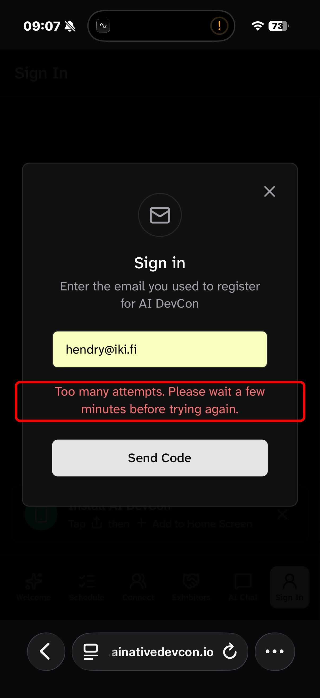
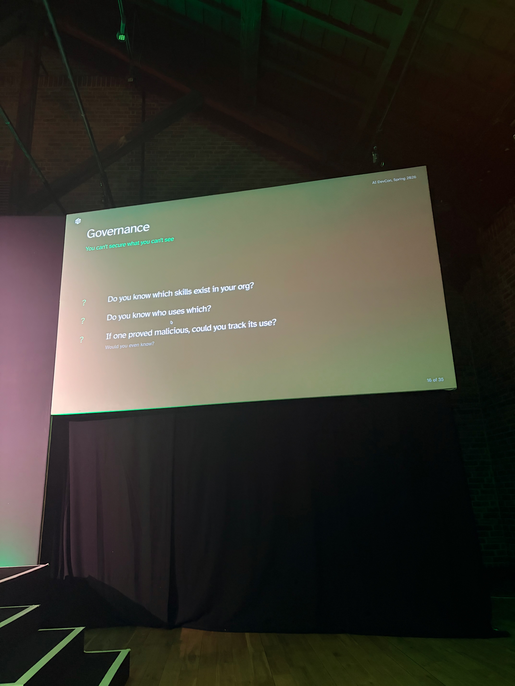
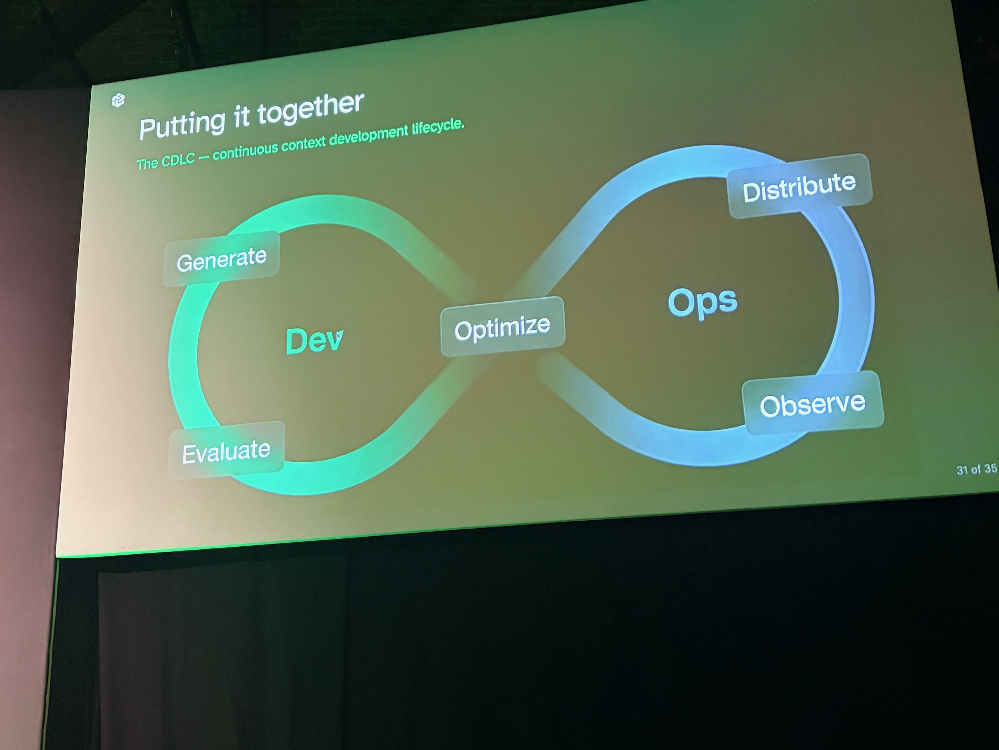
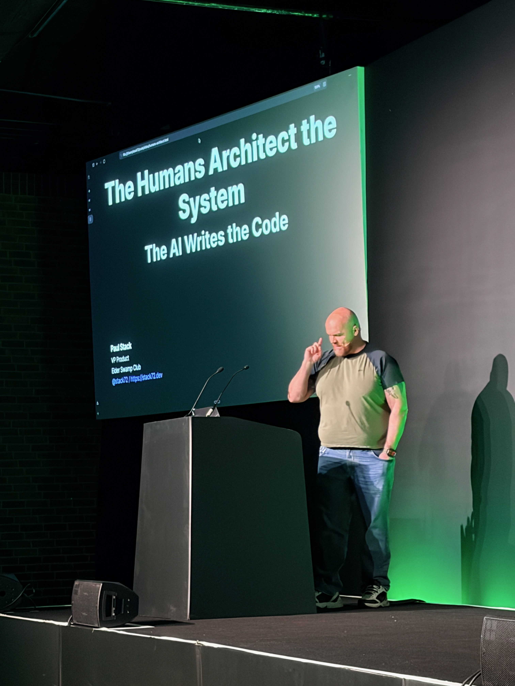
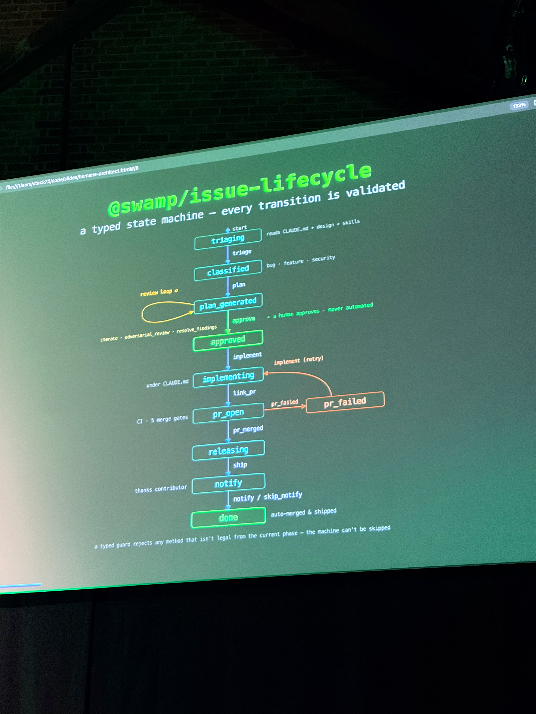
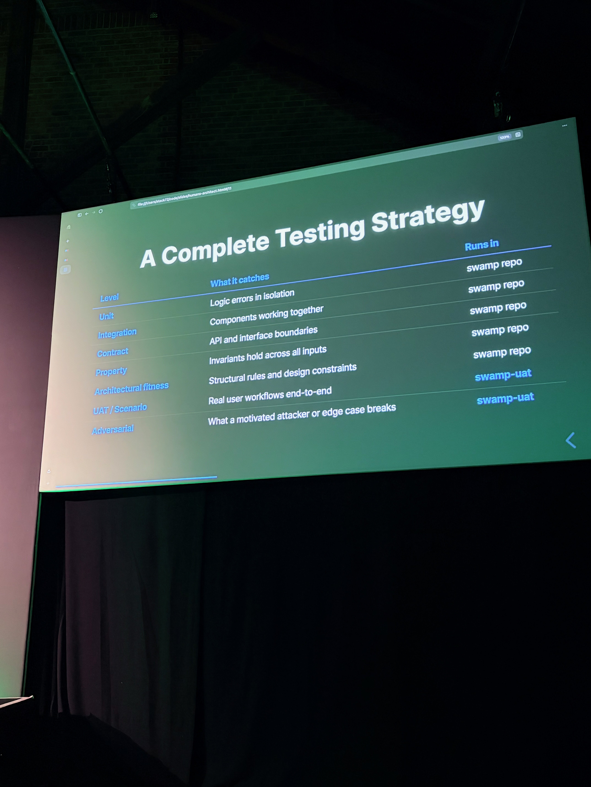
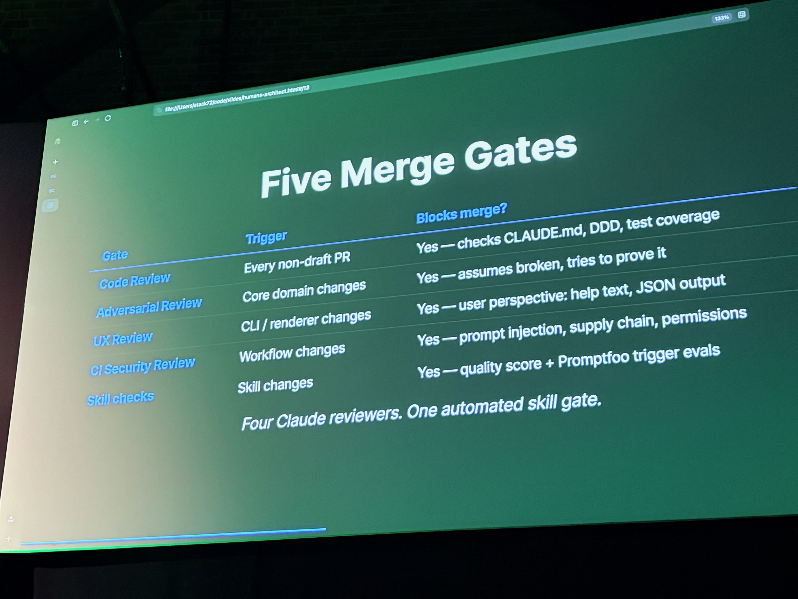
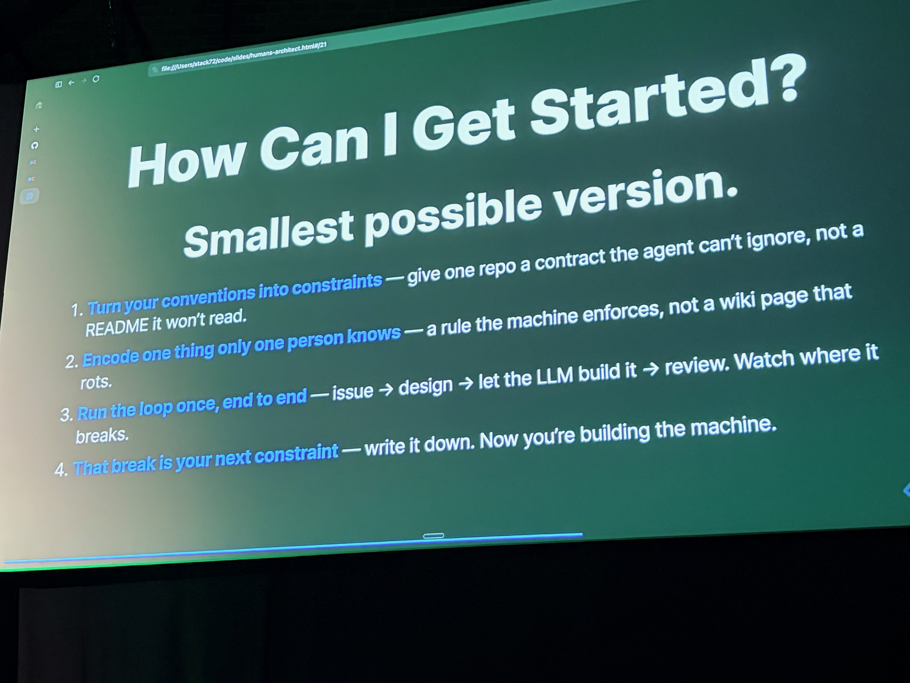
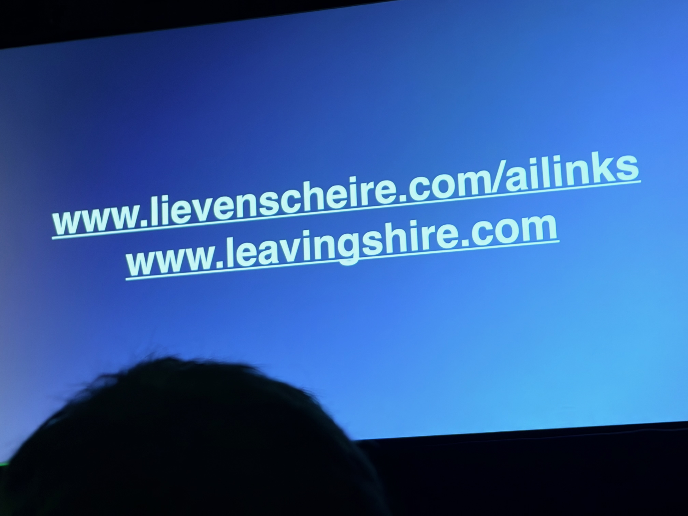

[AI Native DevCon](https://tessl.io/devcon) ran June 1–2 at The Brewery in London. I attended Day 1. Here's how it went.

> **A note on naming:** attendees on X mixed up [#aidevcon](https://x.com/hashtag/aidevcon) and [#ainativedevcon](https://x.com/hashtag/ainativedevcon), splitting the social coverage across two hashtags. Not helped by the fact that the stage branding said "AI DevCon by Tessl" while the YouTube playlist, Luma page, and most prior communications all said "AI Native DevCon". Pick one and stick with it.

> **A note on the agenda:** [tessl.io/devcon](https://tessl.io/devcon) will simply be overwritten when the next DevCon runs — there's no stable URL for this year's schedule, no `/devcon/2026/` or `/devcon/london-2026/`. That's a shame, because the schedule itself is also hard to get at: the page is entirely JavaScript-rendered, with a `BAILOUT_TO_CLIENT_SIDE_RENDERING` marker in the static HTML. Scrapers, RSS readers, and web-fetch tools all come back empty. The Sanity CMS backing the site returns `null` for the talks array. The data eventually surfaced via a YouTube playlist and Google's indexed snippets. The agenda is right there on the screen — it's just not in the page source, and soon it won't be anywhere at all. Compare this with [AI Engineer Europe](https://ai.engineer/europe/schedule), which publishes its schedule as open data: [sessions.json](https://ai.engineer/europe/sessions.json), [speakers.json](https://ai.engineer/europe/speakers.json), [llms.txt](https://ai.engineer/europe/llms.txt), an MCP server, iCal, and embeddings — and even provides a schedule design skill so you can build your own app on top. That's how you do it.

## Breakfast

A proper spread to start: watermelon smoothies and mango-pineapple juices alongside pastries. Good omen.

The Brewery main hall before kick-off. Green lights, big screens, 650 people finding their seats.

---

## 09:00 — [Welcome to AI Native DevCon](https://www.youtube.com/@tessl-ai) — Simon Maple

Simon Maple opened the day framing the shift from "AI-assisted" to "AI-native" as the current challenge: how do you make agentic development reliable at scale? Meanwhile, the conference's own app was falling over. The sign-in flow rate-limited everyone because 650 attendees were sharing the same venue WiFi IP. Even if you got in, the agenda was there — but buried below the fold, requiring a scroll to find. Clumsy UX for something you'd want at a glance between sessions. A small but fitting irony on a day spent talking about reliable systems.

---

## 09:20 — [Skills are the new Code](https://www.youtube.com/watch?v=KpfnldjO3Iw) — Guy Podjarny *(Keynote)*

Guy Podjarny is CEO of [Tessl](https://tessl.io), the company that organised and sponsored the event, so there's an obvious commercial interest in the thesis he's selling. That said, the overall impression was of a team hustling hard to carve out a real position in a fast-moving AI marketplace — commendable, even where the pitch shows through. His keynote made the case that "skills" — reusable, versioned, testable units of context that agents consume — are becoming the primary artifact of software development, displacing code itself.

The governance angle hit home: do you know which skills exist in your org? Who uses them? If one proved malicious, could you track its use? Skills need the same accountability as code.

The testing parallel was sharp: just as unit tests verify code, skill evals verify context. The hierarchy maps almost directly — unit → integration → project → skill evals.

He wrapped with the CDLC (continuous context development lifecycle): Generate → Evaluate → Optimize on the dev side, Distribute → Observe → Optimize on the ops side. A CI/CD loop, but for context.

---

## 10:05 — Parallel sessions

The parallel tracks kicked off across four rooms simultaneously — choosing was painful.

---

## ~11:00 — [The Humans Architect the System, the AI Writes the Code](https://www.youtube.com/watch?v=wuGJNWhUOoE) — Paul Stack

Paul Stack (VP Product, Elder Swamp Club) argued for a clean division of responsibility: humans own intent, constraints, and architecture; agents handle implementation. The key is making that boundary machine-enforceable, not just documented.

His `@swamp/issue-lifecycle` was the concrete example: a typed state machine where every transition is validated. The agent reads CLAUDE.md + design + skills, but a human must approve before it implements. The machine can't be skipped.

A full testing hierarchy: unit, integration, contract, property, architectural fitness, UAT/scenario, adversarial — each level specifying what it catches and where it runs.

Five merge gates, each blocking for a different reason: code review, adversarial review, UX review, security review, and skill eval gates. Four Claude reviewers. One automated skill gate.

The practical on-ramp: turn one convention into a constraint, encode one thing only one person knows, run the loop once end to end, treat the first break as your next constraint. Now you're building the machine.

---

## ~12:00 — [cq — Stack Overflow for Agents](https://www.youtube.com/watch?v=AHIY1XccX_E) — Peter Wilson & Davide Eynard

In one of the breakout rooms, Peter Wilson and Davide Eynard presented [cq](https://tessl.io/registry) — a shared knowledge store that lets agents query curated, team-verified answers rather than hallucinating or repeating solved problems. Institutional memory agents can actually use.

---

## 12:55 — Lunch Break

The Brewery did lunch justice. Good food, better hallway conversations — the kind that only happen when everyone in the room is wrestling with the same problems.

---

## 13:55 — Artificial Intelligence — Lieven Scheire *(Keynote)*

Lieven Scheire — Belgian science communicator and comedian — gave a keynote that stepped back from the engineering details to ask bigger questions about what AI actually is and what we're building toward. A different register from the rest of the day, and a useful one. His resources at [lievenscheire.com/ailinks](https://www.lievenscheire.com/ailinks) are worth a look.

---

## 14:35 — Afternoon sessions

### [Piece of PI — Embedding The OpenClaw Coding Agent In Your Product](https://www.youtube.com/watch?v=Ex1Zu0qel8M) — Matthias Lubken

Matthias walked through the practical experience of embedding OpenClaw directly into a product. The integration challenges were real and honest — dogfooding an AI-native workflow at the product level surfaces edge cases fast.

---

### [Harness Engineering: How to Build Software When Humans Steer and Agents Execute](https://www.youtube.com/watch?v=c8bE0cj7vHY) — Ryan Lopopolo

Ryan introduced "harness engineering" — the scaffolding of specs, constraints, and feedback loops that keeps agents productive and predictable. Good harness design is becoming as important as the code itself.

---

### [Lessons from Spec-driven Development](https://www.youtube.com/watch?v=odbNXv9xXjc) — Simon Martinelli

Simon shared real-world lessons from adopting spec-driven development. Spec quality directly determines agent output quality — obvious in theory, non-obvious in practice when you actually sit down to write specs for a team. I [asked a question during Q&A](https://youtu.be/odbNXv9xXjc?t=1767) about SDD that's worth watching if you're considering the approach.

---

### [Vibe Coding — Is this really the best we can do?](https://www.youtube.com/watch?v=libNzUdL9eM) — Dave Farley

My favourite talk of the day — made better by having already bumped into [Dave](https://www.youtube.com/c/ContinuousDelivery) in the hallway beforehand. That conversation was my favourite moment of the entire conference, and it primed me well for what he then said on stage.



His answer to the title question: no. Vibe coding without feedback loops, testability, or engineering rigour produces fast-moving technical debt. The best of what AI enables should sit on top of good engineering practice, not replace it.

The concrete takeaway: write your acceptance criteria as [Given / When / Then](https://dabase.com/tips/web/2022/Best-bug-reporting-template/) and let the agent work from those. Precise, testable ACs are the spec quality that actually drives good agent output — not prose descriptions, not vibes.

---

## After party

The evening party at The Brewery rounded out the day. Good conversations, a drink or two, and the kind of energy that comes from spending a day with people genuinely excited about where this is all going.

The Brewery as a venue was really very good — the food throughout the day was excellent, and they even had phone charging available. A small touch, but a genuinely thoughtful one. Thank you!

---

Full playlist on the [Tessl YouTube channel](https://www.youtube.com/@tessl-ai).
