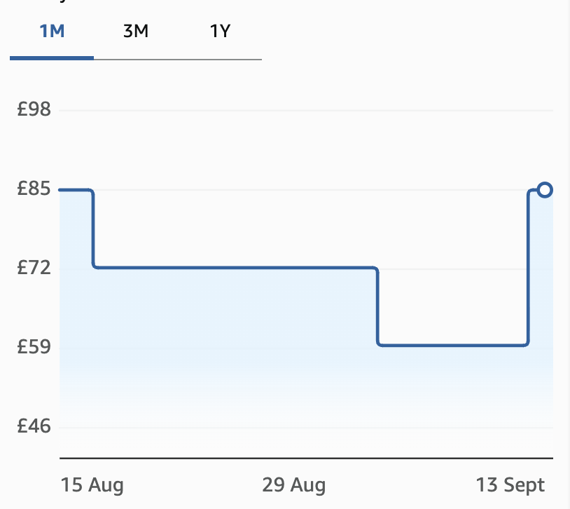

The [Logitech Litra Beam](https://www.amazon.co.uk/dp/B0CHWR8SNR) is my favourite desk lamp.
I like how it can turn on automatically for online meetings to light up my face, then easily be
adjusted to illuminate my desk.

My only niggles:

1. the buttons could be easier to recognise by touch alone
2. it could be a little brighter and bigger

It's a little expensive, so **wait for a discount to around £60**. This
price history shows it dropping to about £59 before going back up to £85.

