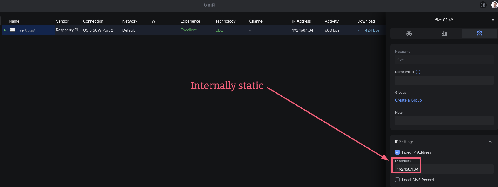
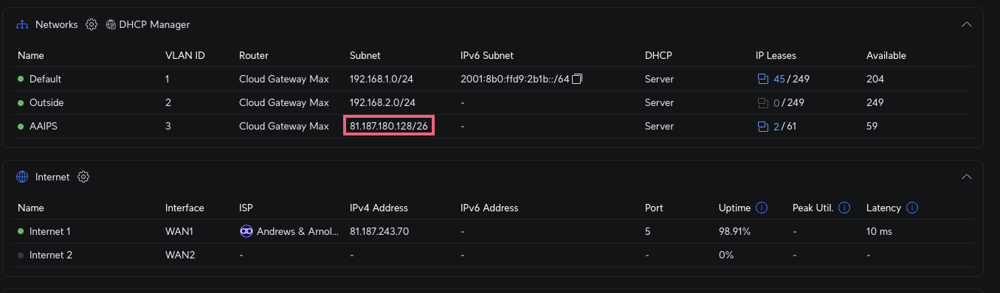
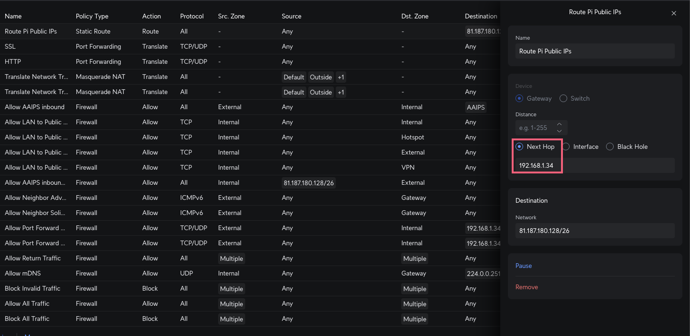

My [Internet Service Provider Andrews & Arnold](https://www.aa.net.uk/) provides my home with Internet services. This is how I configure my Raspberry Pi 5 to leverage the special "legacy" subnet they provide with [Unifi networking hardware/software](https://uk.store.ui.com/uk/en).


My UK ISP A&A has given me some IPv4 addresses:

    $ ipcalc -b 81.187.180.129/26
    Address:   81.187.180.129
    Netmask:   255.255.255.192 = 26
    Wildcard:  0.0.0.63
    =>
    Network:   81.187.180.128/26
    HostMin:   81.187.180.129
    HostMax:   81.187.180.190
    Broadcast: 81.187.180.191
    Hosts/Net: 62                    Class A

The following is how I have configured my Raspberry PI to be able host virtual machines (VPS = Virtual Private Servers) from that subnet.

# Configuring Ubiquiti (UniFi) Network 10.x

https://192.168.1.1/network/default/clients/main



https://192.168.1.1/network/default/settings/settings_overview



Settings on Auto, note **VLAN ID is 3**.

https://192.168.1.1/network/default/settings/policy-table



Notice we route incoming traffic to that subnet to the Raspberry Pi's IP address.

# Configuring Raspberry Pi host

[I'm now using Debian Trixie](https://x.com/kaihendry/status/2006027247761731915) release of [Raspberry Pi OS](https://www.raspberrypi.com/software/operating-systems/).

Tbh I do have `ipv6.disable=1` in /boot/firmware/cmdline.txt to avoid confusion and drama.

### `/etc/systemd/network/10-end0.network`
```ini
[Match]
Name=end0

# could have been DHCP, but I statically define it nonetheless
[Network]
Address=192.168.1.34/24
Gateway=192.168.1.1
DNS=8.8.8.8
DNS=8.8.4.4
VLAN=end0.3
```
---

### `/etc/systemd/network/15-end0.3.netdev`
```ini
[NetDev]
Name=end0.3
Kind=vlan

[VLAN]
Id=3
```
---

### `/etc/systemd/network/15-end0.3.network`
```ini
[Match]
Name=end0.3

[Network]
# No IP needed - containers use macvlan
```
---

To use macvlan over network-veth, I needed:

    pi@five:/etc/systemd/system $ cat systemd-nspawn@.service.d/override.conf
    [Service]
    ExecStart=
    ExecStart=systemd-nspawn --quiet --keep-unit --boot --link-journal=try-guest -U --settings=override --machine=%i


# create-nspawn-vps

[create-nspawn-vps is a helper script](https://gist.github.com/kaihendry/861e5d985217cf457cd31f88c313cb58) to create a new vm / vps / machine on a publicly addressable IP address.

Sample output:

    ✅ Container created successfully!
    Name: debian-houseflies
    User: hendry

    ssh hendry@debian-houseflies
    sudo machinectl shell debian-houseflies
    pi@five:~/vms $ machinectl
    MACHINE            CLASS     SERVICE        OS     VERSION ADDRESSES
    debian-houseflies  container systemd-nspawn debian 13      81.187.180.167
    debian-sacramentos container systemd-nspawn debian 13      81.187.180.130

    2 machines listed.
    pi@five:~/vms $ sudo machinectl shell debian-houseflies
    Connected to machine debian-houseflies. Press ^] three times within 1s to exit session.
    root@debian-houseflies:~# ping google.com
    PING google.com (172.217.76.101) 56(84) bytes of data.
    64 bytes from yulhrp-in-f101.1e100.net (172.217.76.101): icmp_seq=1 ttl=109 time=11.1 ms
    64 bytes from yulhrp-in-f101.1e100.net (172.217.76.101): icmp_seq=2 ttl=109 time=11.0 ms
    ^]64 bytes from yulhrp-in-f101.1e100.net (172.217.76.101): icmp_seq=3 ttl=109 time=11.0 ms
    ^]
    Connection to machine debian-houseflies terminated.

# Raspberry Pi VPS hosting

Now whenever I want a little VPS, I can spawn one and have a play. Tbh I don't quite understand how isolation works and my Pi only has 4GB of memory to play with, so it's pretty underpowered. In future I would like to play with Docker and https://kamal-deploy.org/

Do let me know if it can be further improved!