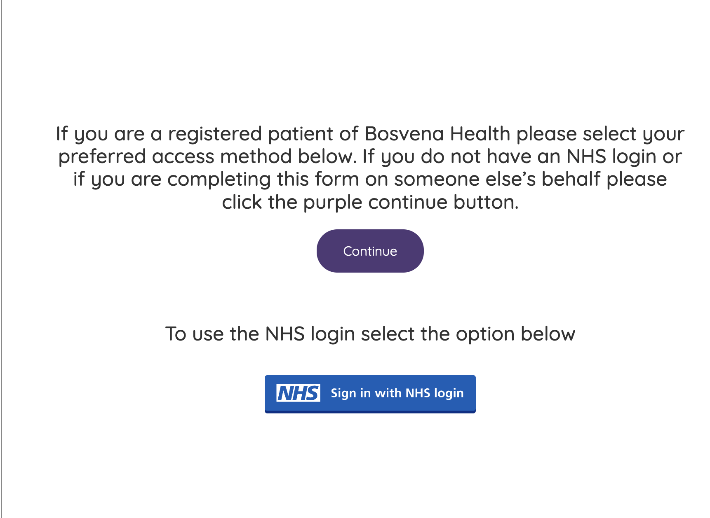

On 5 May 2026 I tried to book a same-day GP appointment for my sick son using
[Klinik Access](https://access.klinik.co.uk/), the online triage form at my
surgery [Bosvena Health](https://www.bosvenahealth.co.uk/). I recorded a
screencast, but since its laden with private information, I won't share it here
and you can't see how awkward their form is.

The form _closes_ outside opening hours — or once daily slots are full — Klinik
calls this a "snooze" page. Unlike any other Web form, you essentially need to
wake up early to submit it or wait until the next day. Once submitted, once a
clinician acts upon it, they will usually call you from an unknown number.

**The form has technical & UX issues.** which makes me think it hasn't properly
been tested. My son's symptoms had to be re-entered multiple times as the form
circled back on itself. By the third pass I nearly gave up. Each extra step is
another dropout, especially for patients on a phone under stress.

**Do not use NHS login if booking for someone else — but good luck knowing that.** When I logged in with my NHS account, my details were locked in as the patient. There is no way to correct this mid-form. The workaround is to ignore the NHS login button and hit Continue instead:

<figure style="text-align:center">
  
</figure>

The instruction is there, but at 8am with a sick child it is easy to miss. Klinik's response was "you should have read the note." That is not UX design — if NHS login breaks the most common proxy scenario (parent booking for child), fix the flow.

**In-form feedback never reaches the practice.** I submitted feedback through the Klinik form several times and never received a response. It turns out this feedback goes directly to Klinik — Bosvena Health never sees it. Klinik's response? They will review whether the wording can be amended to make that clearer. Not fix it — just maybe reword it.

## The complaint

I emailed [bosvena.letters@nhs.net](mailto:bosvena.letters@nhs.net) on 5 May. Bosvena Health's admin team responded promptly, obtained my consent to share a recording of the session with Klinik, and followed up. After chasing two weeks later, Klinik's written response arrived on 1 June.

Klinik acknowledged several issues — snooze page wording, the Pharmacy First loop, the feedback module confusion — and said they had raised others with developers. Address fields do not support browser autofill, forcing tedious manual entry. Klinik attributed this to cookie settings — which I think is false as a software engineer. The NHS login problem was attributed to me not reading the note.

Furthermore feedback submitted through their own form produces no visible improvement and never reaches the GP practice, you need to contact bosvena.letters@nhs.net instead.

## The real problem

Bosvena Health do not own this form. Klinik do. When something goes wrong, the practice must relay complaints to a third party, wait for a response, and pass it back. That is the process I went through — and it took a month.

Meanwhile, every piece of patient feedback submitted through the form goes straight to Klinik. Bosvena never sees it. Patients assume they are giving feedback to their GP surgery. They are not. It vanishes into a vendor's inbox. Does Bosvena care about the satisfaction of the form?

No single party feels fully responsible. Klinik can say the practice configures the form. The practice can say they do not own it. Patients are left navigating a broken experience with no clear owner and no way to make their voice heard where it might actually change something.

That is the structural failure here — not any one bug, but a procurement model that separates accountability from experience.
